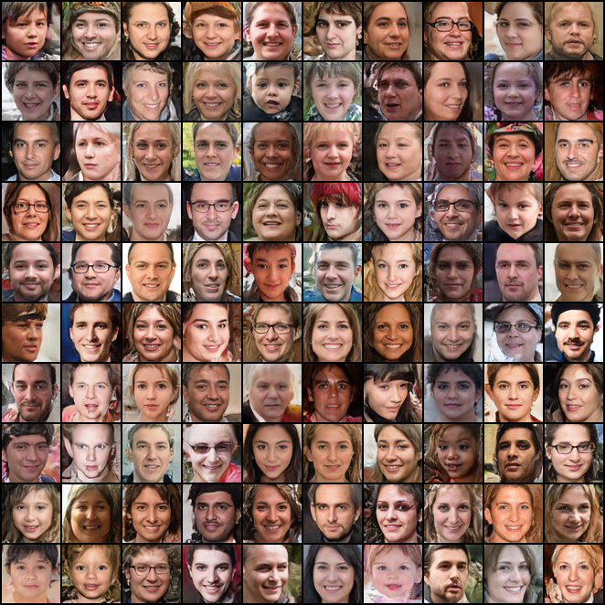

# Progressive growing GANs in PyTorch (WIP)

This repository is an exploration of progressive growing GANs like ProGAN, StyleGAN and StyleALAE.
At this moment it is mostly focussed on StyleALAE and all other algorithms will probably contain bugs or won't work anyways.

## Current results
The current StyleALAE implementation does appear to yield okay results.
Below are the results of a model trained:
- with 30,000 static and 30,000 shifting batches
(which means it does 30,000 batches per resolution and then takes 30,000 batches to slowly shift to the next resolution)
- with 128 channels at 64x64, and 256 for all smaller resolutions. Also using a latent size of 256.
- up to 64x64 images (and for 60,000 static batches on 64x64 instead of the 30,000 used for other resolutions)

Generated images when using Ψ = 0.85:

